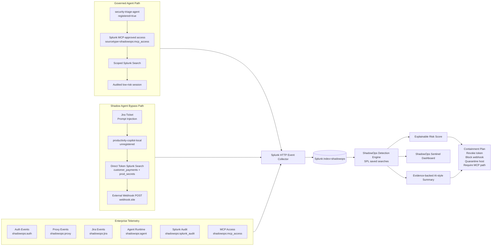

# ShadowOps Sentinel Architecture Diagram

## Data flow

1. Synthetic enterprise events are generated by `generate_shadowops_events.py`.
2. Events are written to JSONL and optionally sent to Splunk HTTP Event Collector.
3. Splunk indexes events in `index=shadowops` with ShadowOps sourcetypes.
4. Detection SPL correlates events by `correlation_id`.
5. The dashboard shows the five-beat demo timeline, risk score, prompt injection evidence, and MCP safe path versus direct-token bypass.
6. The evidence-backed summary turns Splunk-searchable event facts into a containment narrative.

## Why Splunk matters

The project requires cross-source correlation across Jira, proxy, auth, agent runtime, MCP access, and Splunk audit logs. A normal single-tool AI chatbot would not have this full operational view. Splunk acts as the common evidence layer and investigation control plane.
